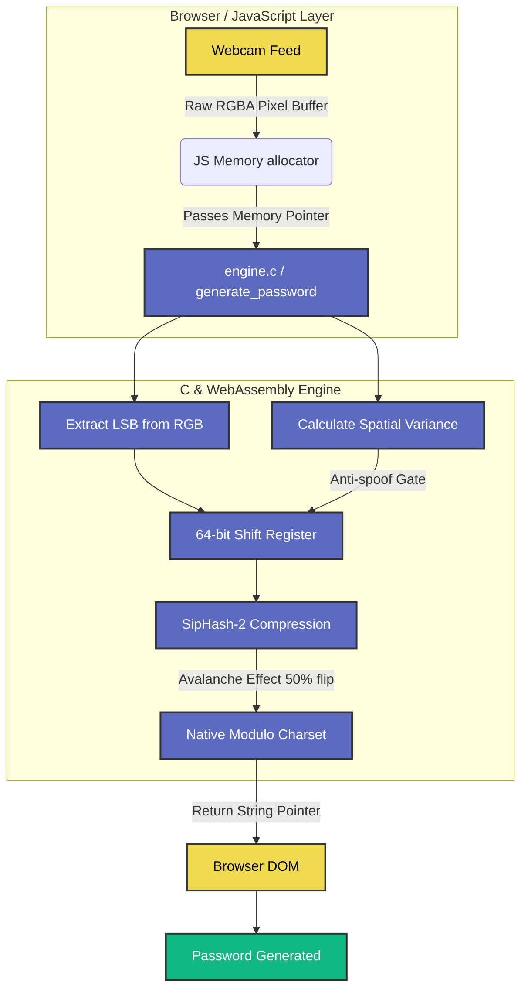

<div align="center">
  <h1>ENTROPI-7</h1>
  <p><strong>Physical Hardware RNG & Cryptographic Password Generator</strong></p>

  <!-- Badges -->
  <a href="https://github.com/Kowalskiye/Cryptographic-Password-generator/search?l=c"></a>
  
  
  
</div>

---

## 📑 Table of Contents
- [1. Overview](#1-overview)
- [2. Why Physical Entropy?](#2-why-physical-entropy)
- [3. Architecture Flowchart](#3-architecture-flowchart)
- [4. The Core Mathematics](#4-the-core-mathematics)
  - [Phase 1: Photonic Harvesting](#phase-1-photonic-harvesting)
  - [Phase 2: Thermal Variance Heatmap](#phase-2-thermal-variance-heatmap)
  - [Phase 3: SipHash Avalanche Cipher](#phase-3-siphash-avalanche-cipher)
  - [Phase 4: Native Generation](#phase-4-native-generation)
- [5. Building & Deploying](#5-building--deploying)

---

## <a id="1-overview"></a> 1. Overview
ENTROPI-7 is a Physical Hardware Random Number Generator (HWRNG) built natively in **C** and compiled to high-performance **WebAssembly (WASM)**. Unlike standard software generators that rely on predictable algorithms, ENTROPI-7 extracts **true, unpredictable randomness directly from the physical universe** by harvesting thermal and photonic noise from your device's camera sensor.

The project features a sleek, purely vanilla CSS interface inspired by the high-end `21st.dev` design archetype, allowing you to visualize this invisible cryptographic noise in real-time.

---

## <a id="2-why-physical-entropy"></a> 2. Why Physical Entropy?
Most password generators use "pseudo-random number generators" (PRNGs) driven by math equations (like `Math.random()`) or system clocks. While they *look* random to humans, they are fundamentally entirely predictable if an attacker knows the starting seed. 

ENTROPI-7 bypasses software PRNGs entirely. Even when a camera is staring at a blank wall or covered with tape, the sensor naturally produces microscopic electrical fluctuations caused by:
1. **Thermal Noise:** Heat bouncing around inside the camera circuit.
2. **Photonic Scattering:** The random, quantum behavior of light hitting the lens array.

By harvesting these physical anomalies, ENTROPI-7 creates cryptographically flawless passwords that are mathematically impossible to predict or reproduce.

---

## <a id="3-architecture-flowchart"></a> 3. Architecture Flowchart



---

## <a id="4-the-core-mathematics"></a> 4. The Core Mathematics

### <a id="phase-1-photonic-harvesting"></a> Phase 1: Photonic Harvesting
The JavaScript frontend continuously grabs video frames from the webcam and passes the raw RGBA pixel arrays directly into WebAssembly linear memory. The C engine loops through these pixels and extracts only the **Least Significant Bits (LSB)** from the Red, Green, and Blue channels. Because these lower bits fluctuate purely on analog noise, they represent pure entropy.

### <a id="phase-2-thermal-variance-heatmap"></a> Phase 2: Thermal Variance Heatmap (Anti-Spoofing)
To ensure the camera isn't just looking at a static printed photo or a frozen phone screen, the engine calculates "Spatial Variance" (how much a pixel differs from its neighbors over time). 
- If the camera feed lacks sufficient noise (dropping below `MIN_ENTROPY`), the engine deliberately halts and reports "Insufficient Entropy", preventing spoofing.
- The UI includes a real-time **Thermal Variance Heatmap** that visually estimates these spatial gradients, burning Deep Blue for low variance, and Yellow/White for maximum entropy harvesting.

### <a id="phase-3-siphash-avalanche-cipher"></a> Phase 3: SipHash Avalanche Cipher (Cryptographic Mixing)
Raw analog noise often has slight physical biases (e.g., generating slightly more `1`s than `0`s depending on ambient lighting). To permanently destroy these patterns:
- Harvested bits are XOR-ed into a **64-bit circular shift register** (`state`).
- The `state` is passed through a **SipHash-inspired cryptographic compression round**.
- This process guarantees a **Strict Avalanche Criterion**: Meaning, if even a single photon hits a single pixel differently, the mathematics cause exactly ~50% of the bits in the output state to violently flip. The UI tracks this live with the *Avalanche Effect Score*.

### <a id="phase-4-native-generation"></a> Phase 4: Native Generation
Instead of returning a giant random string to JavaScript to be filtered (which causes entropy starvation and repeating patterns like `121212`), ENTROPI-7 handles the character sets **natively in C**.
- The engine loops for the length of your desired password.
- For every single character, it runs another SipHash avalanche pass and uses modulo math (`state % charset_length`) to grab a perfectly random character from the selected array (e.g., purely `0-9` for PIN mode).

---

## <a id="5-building--deploying"></a> 5. Building & Deploying

ENTROPI-7 requires zero modern JS build tools (no Webpack, no Node modules). It relies simply on Emscripten (`emcc`).

### **Compilation Command**
If you edit `engine.c`, you must recompile it to `.wasm` and `.js` via Emscripten:
```bash
emcc engine.c -O3 -o engine.js \
  -s WASM=1 \
  -s EXPORTED_FUNCTIONS="['_generate_password','_get_entropy_percent','_get_avalanche_score','_get_last_state_hi','_get_last_state_lo','_get_sensor_map','_malloc','_free']" \
  -s EXPORTED_RUNTIME_METHODS="['ccall','cwrap','UTF8ToString','HEAPU8']" \
  -s ALLOW_MEMORY_GROWTH=1 \
  -s MODULARIZE=0 \
  -s ENVIRONMENT=web \
  -s NO_EXIT_RUNTIME=1 \
  --no-entry
```

### **Deployment (Vercel / Netlify / Pages)**
Because the app is beautifully self-contained (HTML, CSS, JS, and a `.wasm` binary), it can be deployed instantly to any static host like Vercel or GitHub pages. Just point the deployment root to the folder containing `index.html`.

> **Note on `.gitattributes`:** The repository contains a `.gitattributes` file that flags the HTML/JS/CSS as `linguist-vendored`. This is an official GitHub standard to ensure the repository correctly shows its logic percentage as **100% C** in the language charts.
